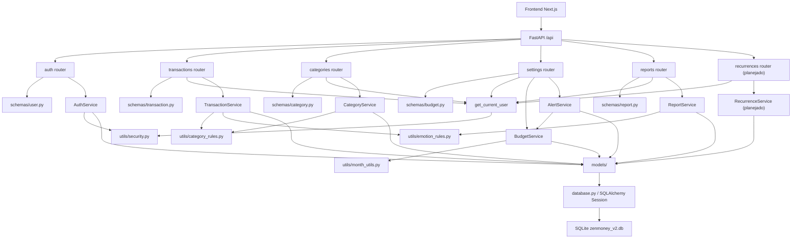

# Arquitetura Backend Alinhada ao Sistema - ZenMoney

## 1. Objetivo

Este documento descreve a arquitetura do backend do ZenMoney em modulos funcionais, mostrando como cada modulo se comunica com os demais e como participa da operacao geral do sistema. A estrutura segue o padrao MVC em camadas adaptado ao FastAPI:

A fonte principal para consultar os requisitos do projeto e `docs/REQUISITOS_PROJETO.md`. Em caso de conflito, decisoes posteriores confirmadas pela equipe e registradas nesse documento prevalecem.

```text
Router -> Schema -> Service -> Model -> Database
```

O backend e a fonte oficial das regras de negocio, validacoes, categorias, emocoes, calculos financeiros, alertas e relatorios. O frontend consome essas regras por meio da API REST.

## 2. Decisoes de arquitetura

### 2.1 MVC em camadas

O backend e organizado por camadas tecnicas:

| Camada | Pasta/arquivo | Responsabilidade |
|---|---|---|
| Entrada da aplicacao | `main.py` | Cria a app FastAPI, registra routers e inicializa tabelas. |
| Configuracao | `config.py` | Centraliza variaveis de ambiente e valores padrao. |
| Banco | `database.py` | Configura engine, sessao SQLAlchemy, `get_db` e seed inicial. |
| Controllers HTTP | `routers/` | Define endpoints e converte erros de service em HTTP. |
| Contratos | `schemas/` | Valida payloads e define respostas da API. |
| Regras de negocio | `services/` | Contem a logica principal dos dominios. |
| Persistencia | `models/` | Mapeia tabelas SQLAlchemy. |
| Utilitarios | `utils/` | Regras auxiliares reutilizaveis e sem dependencia de camada superior. |
| Testes | `tests/` | Testes automatizados com pytest e SQLite em memoria. |

### 2.2 Banco SQLite

O projeto usa SQLite por simplicidade, adequacao ao contexto academico e baixa necessidade de infraestrutura. As tabelas sao criadas com `Base.metadata.create_all`.

### 2.3 Autenticacao stateless com JWT

O backend usa JWT no header:

```http
Authorization: Bearer <token>
```

O logout e implementado por revogacao do `jti` do token em tabela propria.

### 2.4 Backend como fonte de verdade

O backend define:

- categorias padrao e categorias do usuario;
- emocoes aceitas;
- validacao de transacoes;
- regras de orcamento e alertas;
- dados agregados de relatorios;
- regras futuras de recorrencia, previsao e modo sobrevivencia.

## 3. Diagrama de arquitetura



## 4. Modulos funcionais

### 4.1 Modulo de Bootstrap e Configuracao

Responsabilidade: iniciar a API, carregar configuracoes e preparar a aplicacao para receber requisicoes.

Componentes:

| Componente | Status | Papel |
|---|---|---|
| `main.py` | Existente | Cria o FastAPI, registra routers e executa `create_db_and_tables()` no lifespan. |
| `config.py` | Existente | Define `APP_NAME`, `API_PREFIX`, `DATABASE_URL`, `SECRET_KEY`, expiracao de token e regras de bloqueio. |
| `.env` | Existente local | Guarda configuracoes sensiveis ou especificas do ambiente local. |
| `.env.example` | Existente | Modelo seguro para versionamento. |
| CORS middleware | Planejado | Deve liberar a origem do frontend, como `http://localhost:3000`. |

Comunicacao:

```text
main.py -> config.py
main.py -> routers/*
main.py -> database.create_db_and_tables()
```

Melhoria recomendada:

Adicionar `FRONTEND_ORIGIN` ao `.env` e configurar `CORSMiddleware`.

### 4.2 Modulo de Banco de Dados

Responsabilidade: gerenciar conexao com SQLite, sessoes SQLAlchemy e criacao inicial de tabelas.

Componentes:

| Componente | Status | Papel |
|---|---|---|
| `database.py` | Existente | Cria engine, `SessionLocal`, `Base`, `get_db` e habilita foreign keys no SQLite. |
| `seed_default_categories()` | Existente | Insere categorias padrao do sistema quando nao existem. |
| `zenmoney_v2.db` | Existente local | Arquivo SQLite usado em desenvolvimento. |

Comunicacao:

```text
routers -> get_db()
services -> Session
models -> Base
database.py -> SQLite
```

Estado atual:

A lista de categorias padrao cobre integralmente as categorias previstas no RF03 e preserva categorias extras de versoes anteriores por compatibilidade.

### 4.3 Modulo de Autenticacao e Perfil

Responsabilidade: cadastro, login, logout, bloqueio por tentativas, perfil e senha.

Componentes:

| Componente | Status | Papel |
|---|---|---|
| `routers/auth.py` | Existente | Endpoints de cadastro, login, logout e usuario atual. |
| `routers/settings.py` | Existente | Endpoints de perfil e senha. |
| `schemas/user.py` | Existente | Contratos de cadastro, login, resposta do usuario, token e senha. |
| `services/auth_service.py` | Existente | Regras de cadastro, login, bloqueio, logout, perfil e troca de senha. |
| `models/user.py` | Existente | Tabela de usuarios. |
| `models/revoked_token.py` | Existente | Tabela de tokens revogados. |
| `auth_dependencies.py` | Existente | Recupera usuario autenticado via token Bearer. |
| `utils/security.py` | Existente | Hash bcrypt, criacao e validacao de JWT. |

Endpoints:

- `POST /api/auth/register`
- `POST /api/auth/login`
- `POST /api/auth/logout`
- `GET /api/auth/me`
- `GET /api/settings/profile`
- `PUT /api/settings/profile`
- `PUT /api/settings/password`

Fluxo:

```text
router/auth.py
  -> schemas/user.py valida payload
  -> AuthService executa regra
  -> User/RevokedToken persiste dados
  -> utils/security gera ou valida token
```

Decisao importante:

`register` nao retorna token. O frontend deve enviar o usuario para login ou chamar login automaticamente depois do cadastro.

### 4.4 Modulo de Transacoes

Responsabilidade: CRUD de receitas e despesas do usuario autenticado.

Componentes:

| Componente | Status | Papel |
|---|---|---|
| `routers/transactions.py` | Existente | Endpoints de CRUD e listagem de emocoes. |
| `schemas/transaction.py` | Existente | Contratos de criacao, atualizacao e resposta de transacao. |
| `services/transaction_service.py` | Existente | Regras de propriedade, categoria compativel, normalizacao de descricao e emocao. |
| `models/transaction.py` | Existente | Tabela de transacoes. |
| `utils/emotion_rules.py` | Existente | Lista e normalizacao de emocoes aceitas. |
| `utils/category_rules.py` | Existente | Tipos de categoria e normalizacao. |

Endpoints:

- `POST /api/transactions/`
- `GET /api/transactions/`
- `GET /api/transactions/{id}`
- `PUT /api/transactions/{id}`
- `DELETE /api/transactions/{id}`
- `GET /api/transactions/emotions`

Comunicacao:

```text
transactions router
  -> get_current_user
  -> TransactionService
  -> Category valida categoria acessivel e tipo
  -> Transaction persiste no SQLite
```

Regras:

- frontend nao envia `user_id`;
- usuario so acessa suas proprias transacoes;
- categoria deve pertencer ao usuario ou ser global;
- categoria deve ter o mesmo tipo da transacao;
- emocao deve estar na lista oficial do backend.

Melhoria recomendada:

Adicionar filtro opcional por mes, data inicial, data final, categoria, tipo e emocao para facilitar telas com filtros.

### 4.5 Modulo de Categorias

Responsabilidade: categorias padrao, categorias personalizadas e subcategorias.

Componentes:

| Componente | Status | Papel |
|---|---|---|
| `routers/categories.py` | Existente | Endpoints de CRUD de categorias. |
| `schemas/category.py` | Existente | Contratos de criacao, atualizacao e resposta. |
| `services/category_service.py` | Existente | Regras de nome unico, categoria mutavel, parent compativel e ciclos. |
| `models/category.py` | Existente | Tabela de categorias e auto-relacionamento por `parent_id`. |
| `utils/category_rules.py` | Existente | Categorias padrao e tipos `income`/`expense`. |

Endpoints:

- `POST /api/categories/`
- `GET /api/categories/`
- `PUT /api/categories/{id}`
- `DELETE /api/categories/{id}`

Comunicacao:

```text
categories router
  -> get_current_user
  -> CategoryService
  -> Category model
  -> SQLite
```

Regras:

- categorias padrao tem `user_id = null`;
- categorias do usuario tem `user_id = current_user.id`;
- categorias padrao nao podem ser editadas nem excluidas;
- nomes nao podem duplicar dentro do mesmo tipo para o usuario;
- subcategoria deve ter o mesmo tipo da categoria pai.

Ponto de alinhamento:

Ao excluir uma categoria personalizada, o backend reclassifica suas transacoes e recorrencias para `Nao especificado` do mesmo tipo. Subcategorias da categoria removida permanecem existentes como categorias raiz.

### 4.6 Modulo de Emocoes

Responsabilidade: expor e validar as emocoes permitidas para despesas.

Componentes:

| Componente | Status | Papel |
|---|---|---|
| `utils/emotion_rules.py` | Existente | Define valores aceitos, labels e normalizacao. |
| `schemas/emotion.py` | Existente | Contrato de opcao de emocao. |
| `GET /api/transactions/emotions` | Existente | Endpoint que retorna lista para o frontend. |

Comunicacao:

```text
frontend EmotionSelect
  -> GET /api/transactions/emotions
  -> build_emotion_options()
```

Estado atual:

A lista oficial esta alinhada ao RF04. Apenas despesas armazenam emocoes selecionadas; receitas e registros antigos com valores fora da lista oficial usam `not_specified`. O frontend deve continuar consumindo a API, sem lista manual fixa.

### 4.7 Modulo de Orcamento e Teto de Gastos

Responsabilidade: limites mensais globais e por categoria.

Componentes:

| Componente | Status | Papel |
|---|---|---|
| `routers/settings.py` | Existente | Expõe endpoints de budget dentro de settings. |
| `schemas/budget.py` | Existente | Contratos de limite, status e alerta. |
| `services/budget_service.py` | Existente | Cria, atualiza, remove e calcula uso de limites. |
| `models/budget_limit.py` | Existente | Tabela de limites de gastos. |
| `utils/month_utils.py` | Existente | Interpreta `month=YYYY-MM`. |

Endpoints:

- `GET /api/settings/budget?month=YYYY-MM`
- `PUT /api/settings/budget?month=YYYY-MM`

Comunicacao:

```text
settings router
  -> BudgetService
  -> BudgetLimit
  -> Transaction para calcular gasto
  -> Category para nome e tipo
```

Regras:

- limite global usa `category_id = null`;
- limite por categoria so aceita categoria de despesa;
- valor deve ser maior que zero;
- `null` remove limite;
- receitas nao entram no calculo.

### 4.8 Modulo de Alertas Criticos

Responsabilidade: emitir alertas quando gastos cruzarem faixas do teto.

Componentes:

| Componente | Status | Papel |
|---|---|---|
| `services/alert_service.py` | Parcial | Verifica alerta de budget; modo sobrevivencia ainda nao implementado. |
| `models/budget_alert.py` | Existente | Guarda historico de faixas ja emitidas. |
| `schemas/budget.py` | Existente | Define resposta de alerta. |
| `routers/settings.py` | Existente | Expõe `/settings/budget/alert`. |

Endpoint:

- `GET /api/settings/budget/alert?month=YYYY-MM`

Comunicacao:

```text
settings router
  -> AlertService
  -> BudgetService calcula uso
  -> BudgetAlert evita repetir faixa
  -> retorna alerta mais alto
```

Regra:

Alertas sao disparados de 10% em 10%, uma unica vez por mes e por escopo.

### 4.9 Modulo de Relatorios

Responsabilidade: gerar dados agregados para dashboard, graficos e insights.

Componentes:

| Componente | Status | Papel |
|---|---|---|
| `routers/reports.py` | Existente | Endpoints de relatorios. |
| `schemas/report.py` | Existente | Contratos de resumo, categoria, emocao e gatilhos. |
| `services/report_service.py` | Existente | Agregacoes por transacao, categoria e emocao. |
| `models/transaction.py` | Existente | Fonte principal dos dados. |
| `models/category.py` | Existente | Complementa relatorios por categoria. |
| `utils/emotion_rules.py` | Existente | Labels e normalizacao de emocoes. |

Endpoints:

- `GET /api/reports/summary`
- `GET /api/reports/by-emotion`
- `GET /api/reports/by-category`
- `GET /api/reports/triggers`

Comunicacao:

```text
reports router
  -> get_current_user
  -> ReportService
  -> Transaction + Category
  -> schemas/report.py
  -> frontend dashboard
```

Melhoria necessaria:

Adicionar filtros opcionais:

- `month=YYYY-MM`
- futuramente `start_date` e `end_date`

Isso alinha o backend ao Dashboard com seletor de mes.

### 4.10 Modulo de Recorrencias

Responsabilidade: agendar transacoes que se repetem, como salario, aluguel e assinaturas.

Status: model existente, endpoints e service ainda planejados.

Componentes:

| Componente | Status | Papel |
|---|---|---|
| `models/recurrence.py` | Existente | Tabela de recorrencias. |
| `schemas/recurrence.py` | Planejado | Contratos de criacao, atualizacao e resposta. |
| `routers/recurrences.py` | Planejado | Endpoints de CRUD, pausar e retomar recorrencias. |
| `services/recurrence_service.py` | Planejado | Regras de calendario, proxima execucao e geracao de transacoes. |
| Job/manual trigger | Planejado | Aciona criacao de transacoes pendentes. Para projeto academico, pode ser endpoint manual protegido. |

Endpoints ideais:

- `POST /api/recurrences/`
- `GET /api/recurrences/`
- `PUT /api/recurrences/{id}`
- `PATCH /api/recurrences/{id}/pause`
- `PATCH /api/recurrences/{id}/resume`
- `DELETE /api/recurrences/{id}`
- `POST /api/recurrences/run-due`

Comunicacao ideal:

```text
recurrences router
  -> RecurrenceService
  -> Recurrence model
  -> Transaction model quando gerar lancamento
```

### 4.11 Modulo de Modo Sobrevivencia

Responsabilidade: sugerir reducao de gastos quando o usuario se aproxima do teto.

Status: planejado; existe metodo reservado em `AlertService`.

Componentes ideais:

| Componente | Papel |
|---|---|
| `AlertService.evaluate_survival_mode()` | Avalia percentual de uso do limite e identifica categorias nao essenciais. |
| `schemas/survival.py` | Define resposta com recomendacoes. |
| `routers/survival.py` ou endpoint em `reports/settings` | Exibe recomendacoes ao frontend. |
| `Category.is_essential` | Base para diferenciar gasto essencial e nao essencial. |

Endpoint ideal:

- `GET /api/reports/survival-mode?month=YYYY-MM`

Comunicacao ideal:

```text
survival endpoint
  -> AlertService
  -> BudgetService
  -> Transaction + Category
  -> recomendacoes para frontend
```

### 4.12 Modulo de Previsao de Saldo

Responsabilidade: estimar saldo ao final do mes com base na media dos ultimos 3 meses.

Status: planejado; existe `PredictionService` reservado.

Componentes ideais:

| Componente | Papel |
|---|---|
| `services/prediction_service.py` | Calcula media historica e projecao. |
| `schemas/prediction.py` | Contrato de resposta da previsao. |
| endpoint de previsao | Fornece dados ao Dashboard. |

Endpoint ideal:

- `GET /api/reports/balance-prediction?month=YYYY-MM`

Comunicacao ideal:

```text
reports router
  -> PredictionService
  -> Transaction historico dos ultimos 3 meses
  -> previsao para dashboard
```

### 4.13 Modulo de Privacidade e Conta

Responsabilidade: permitir exclusao de dados pessoais, conforme requisito nao funcional de privacidade.

Status: planejado.

Componentes ideais:

| Componente | Papel |
|---|---|
| `AccountService` | Centraliza exclusao de conta e dados relacionados. |
| endpoint de exclusao | Remove usuario autenticado e dados em cascata. |
| confirmacao por senha | Evita exclusao acidental. |

Endpoint ideal:

- `DELETE /api/settings/account`

Comunicacao ideal:

```text
settings router
  -> AccountService
  -> User model
  -> cascade remove transacoes, categorias, limites, alertas e tokens
```

### 4.14 Modulo de Testes

Responsabilidade: validar regras e evitar regressao.

Componentes:

| Componente | Status | Papel |
|---|---|---|
| `tests/conftest.py` | Existente | Configura SQLite em memoria e sobrescreve `get_db`. |
| `test_auth.py` | Existente | Valida autenticacao. |
| `test_transactions.py` | Existente | Valida CRUD de transacoes. |
| `test_categories.py` | Existente | Valida categorias. |
| `test_budget.py` | Existente | Valida teto e alertas. |
| `test_reports.py` | Existente | Valida relatorios. |
| testes futuros | Planejado | Recorrencias, previsao, modo sobrevivencia, filtros de relatorio e CORS. |

Comunicacao:

```text
pytest
  -> TestClient
  -> FastAPI app
  -> SQLite em memoria
```

## 5. Fluxos operacionais

### 5.1 Criacao de usuario e login

```text
POST /api/auth/register
  -> UserCreate valida payload
  -> AuthService verifica e-mail unico
  -> hash_password
  -> User salvo

POST /api/auth/login
  -> AuthService valida senha
  -> verifica bloqueio temporario
  -> create_access_token
  -> retorna token e usuario
```

### 5.2 Requisicao autenticada

```text
Frontend envia Authorization: Bearer token
  -> get_current_user
  -> decode_access_token
  -> verifica RevokedToken
  -> carrega User
  -> router chama service com current_user
```

### 5.3 Criacao de transacao

```text
POST /api/transactions/
  -> TransactionCreate valida tipo, valor, data e emocao
  -> get_current_user identifica usuario
  -> TransactionService valida categoria
  -> Transaction salva no banco
  -> frontend pode consultar alerta de budget
```

### 5.4 Dashboard

```text
GET /api/reports/summary
GET /api/reports/by-category
GET /api/reports/by-emotion
GET /api/reports/triggers
GET /api/settings/budget
GET /api/settings/budget/alert
```

O frontend combina essas respostas para exibir cards, graficos e alertas.

## 6. Estrutura atual e estrutura planejada

Estrutura atual principal:

```text
backend/
  main.py
  config.py
  database.py
  auth_dependencies.py
  routers/
  schemas/
  services/
  models/
  utils/
  tests/
```

Extensoes planejadas:

```text
backend/
  routers/
    recurrences.py
  schemas/
    recurrence.py
    prediction.py
    survival.py
  services/
    recurrence_service.py
    account_service.py
```

## 7. Contratos de integracao com frontend

Principios:

- todos os endpoints de negocio usam prefixo `/api`;
- rotas privadas exigem token Bearer;
- frontend nao envia `user_id`;
- categorias e emocoes sao consultadas da API;
- dinheiro deve ser tratado com cuidado por causa de `Decimal`;
- erros devem retornar `detail` compreensivel para o frontend;
- relatorios devem ganhar filtro mensal para alinhar com dashboard.

## 8. Conclusao

A arquitetura backend atual esta coerente com MVC em camadas e adequada ao escopo de faculdade. Ela separa entrada HTTP, validacao, regra de negocio, persistencia e utilitarios.

Os principais ajustes arquiteturais recomendados para manter alinhamento com o frontend sao:

- configurar CORS;
- completar categorias e emocoes oficiais;
- adicionar filtro mensal aos relatorios;
- implementar endpoints de recorrencia, previsao e modo sobrevivencia quando essas RFs entrarem;
- documentar a regra final de exclusao de categorias.

Com isso, o backend permanece como centro das regras do sistema, enquanto o frontend atua como camada de experiencia e consumo da API.
